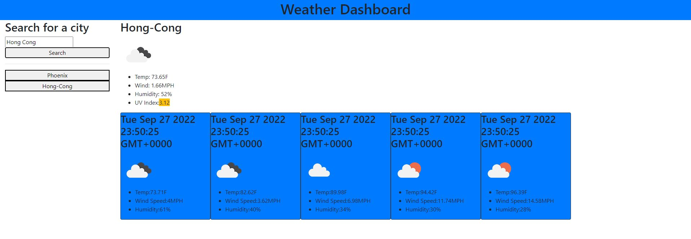

# Weather-Dashboard

## Description

This project can take the input of a city from a user and display the current and future weather information.  This is possible through a third party API called one call from the Weather API.  This API sends me information when I request it allowing me to display it too users.  A key motivation in this project was to meet all the acceptance criteria while using as little lines of code as possible.  I was able to accomplish this by reusing functions.  This application solves the issue of not knowing what the weather is like in a city.  I learned a lot throughout the course of building this application.  Some things that I learned were how to pass information through a function paramater.  Another thing I improved on was object traversal.  This whole application was possible through the use of vanilla JavaScript and Moment.js.

## License

MIT

## Links
[Deployed Application](https://unheardof77.github.io/Weather-Dashboard/)
[GitHub Repository](https://github.com/unheardof77/Weather-Dashboard)

